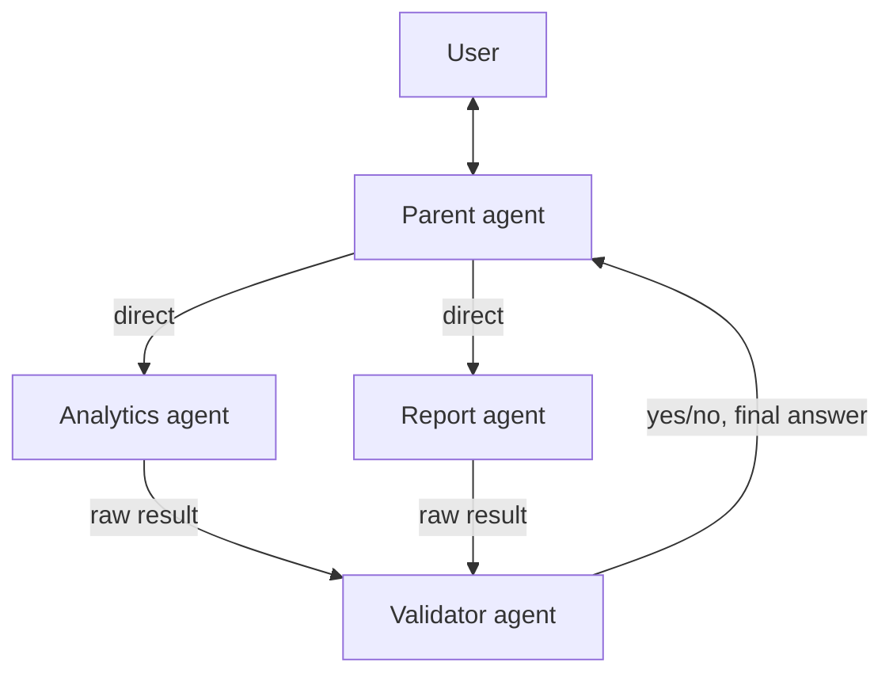

# Flow 2 Architecture: As Implemented in Code

## Your specified flow (now implemented)

```
Parent Agent → Report Agent
Parent Agent → Analytics Agent

Report Agent → Validator Agent
Analytics Agent → Validator Agent

Validator Agent → Parent Agent (yes/no)
```

- **Parent** has direct arrows to **Report** and **Analytics** (Parent calls them via `AgentTool`).
- **Report** and **Analytics** each send their results to the **Validator**.
- **Validator** sends the final answer (yes/no, formatted) **to** the Parent.
- **Parent** handles greetings (hi, hey, help) directly, no tools.

---

## ASCII diagram

```
                    ┌─────────────┐
                    │    User     │
                    └──────┬──────┘
                           │
                    ┌──────▼──────┐
                    │   Parent    │   ← root agent (handles hi/hey/help directly)
                    │   agent     │
                    └──────┬──────┘
                           │
              direct arrows (AgentTool)
              ┌────────────┼────────────┐
              │            │            │
         ┌────▼────┐  ┌────▼────┐       │
         │Analytics│  │ Report  │       │
         │ agent   │  │ agent   │       │
         └────┬────┘  └────┬────┘       │
              │            │            │
              │   raw result            │
              │            │            │
              └────────────┼────────────┘
                           │
                    ┌──────▼──────┐
                    │ Validator   │   ← real ADK agent (visible in flow diagram)
                    │ agent       │   Validator → Parent (yes/no)
                    └──────┬──────┘
                           │
                    final answer to Parent → User
```

---

## Mermaid diagram



---

## Implementation details

| Component | Type | Role |
|-----------|------|------|
| **Parent agent** | `LlmAgent` | Root. Handles greetings directly. Calls `analytics_agent` and `report_agent` via `AgentTool`. |
| **Analytics agent** | `LlmAgent` | Has `execute_query` (DB) and `validator_tool` (AgentTool wrapping Validator). Runs query, sends result to Validator, returns Validator's response. |
| **Report agent** | `LlmAgent` | Has `generate_and_send_report` and `validator_tool`. Generates report, sends to Discord, sends status to Validator, returns Validator's response. |
| **Validator agent** | `LlmAgent` | Approves/disapproves raw results. Formats final answer. **Visible in ADK flow diagram.** |

---

## Is this approach applicable?

**Yes.** The flow is fully supported by ADK:

1. **Parent → Analytics, Parent → Report**: Parent uses `AgentTool(analytics_agent)` and `AgentTool(report_agent)`.
2. **Analytics → Validator, Report → Validator**: Analytics and Report each have `validator_tool = AgentTool(validator_agent)` and call it with their raw result.
3. **Validator → Parent**: The Validator's output is returned by the tool to the calling agent (Analytics/Report), which returns it to the Parent. So the Parent receives the Validator's answer.

**Trade-offs** (as in your diagram notes):
- **Pros**: Single point of validation, consistent formatting.
- **Cons**: Extra latency (Validator LLM call), Validator is a bottleneck.

The Validator agent now appears as a real node in the ADK flow diagram because it is an `LlmAgent` invoked via `AgentTool`.
